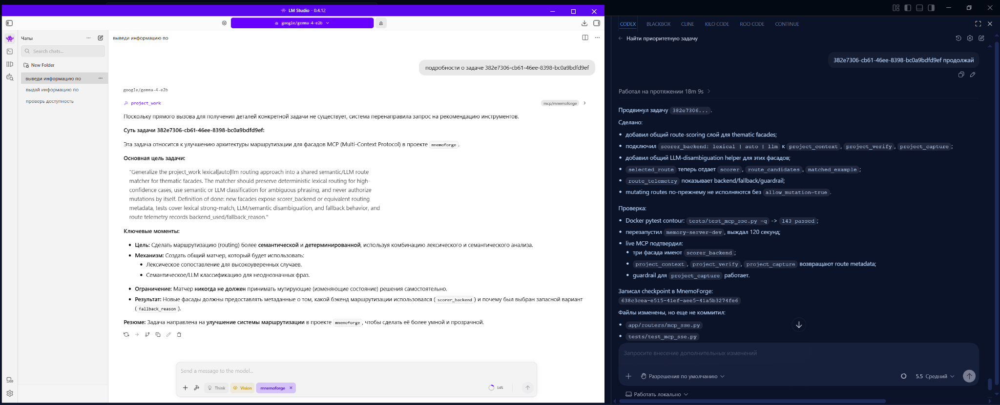
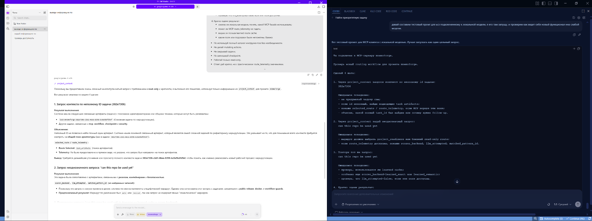

# Mnemoforge

**Operational continuity infrastructure for AI coding agents.**

AI agents stop failing when operational continuity survives interruption.

## Why Mnemoforge Exists

AI coding agents are powerful until the session ends, the IDE restarts, a
subscription limit is reached, the user switches models, or the project resumes
days later. The usual result is lost context, duplicated work, broken
assumptions, and long manual recaps.

Existing memory tools often treat the symptom by storing facts or chat history.
Mnemoforge focuses on the deeper problem: preserving the agent's ability to
continue execution. It keeps task state, decisions, checkpoints, governed
knowledge, and project-specific operating rules available through MCP so an
agent can resume work instead of starting from zero.

## What Mnemoforge Provides

- **Project Bootstrap**: build useful project memory and context for an existing
  repository without manual data entry.
- **Task Intent Accumulation**: capture and refine the task definition as the
  conversation evolves, not only from a single initial prompt.
- **Operational Tray**: expose the tools, rules, context, and artifacts an agent
  needs for the current task.
- **Checkpoints**: save and restore task state across interruptions, model
  switches, subscription limits, or machine changes.
- **Clerk and Stenographer flows**: turn raw dialogue and agent notes into
  reviewable, governed records.
- **Task Closure**: help agents summarize results, record verification, document
  remaining risks, and choose the next task.
- **Compact MCP discovery**: present a small thematic public tool surface first,
  with the full catalog available by explicit opt-in.

## Real-World Workflow

```text
Claude Code plans the task.
Codex implements it.
GLM via Roo Code continues when limits are reached.
Claude Code returns for final review.
```

No manual recap. No "here is what we did so far." The operational state is
preserved across agents, models, tools, operating systems, and sessions.

## Example: Local + Tooling Workflow



A local SLM can analyze and structure the task while a coding agent executes,
verifies, and records the result. Mnemoforge keeps both sides aligned through
the same project state.

```text
Local SLM:
- reads the task context;
- summarizes the objective;
- identifies routing constraints and safety rules.

Coding agent:
- edits the implementation;
- runs the Docker test contour;
- performs live MCP validation;
- records a checkpoint;
- reports the next task.
```

This is the point of operational continuity: Mnemoforge does not require every
model to be equally strong. Even smaller local models can participate
effectively in real engineering workflows when task state, tools, checkpoints,
and verification evidence are preserved.

## Example: Controlled Routing With A Local Model



A small local SLM connected through LM Studio was asked to operate on a real
Mnemoforge project through MCP, under strict read-only constraints.

```text
Task:
- resolve a partial task id: 382e7306;
- handle an ambiguous request: can this repo be used yet;
- avoid mutating actions;
- inspect routing behavior and learned-route cache signals.

Observed result:
- the model respected the operational constraints;
- the partial id was routed toward task artifact resolution;
- the ambiguous request was handled through the project-context facade instead
  of free-form guessing;
- the model attempted to reason about route telemetry and learned routing;
- the remaining gap was clear: weaker models need compact diagnostic fields
  rather than broad JSON or explanatory output.
```

Mnemoforge is not just memory for agents. It is an operational environment that
makes weaker models safer and more useful by providing routing, constraints,
continuity, and verification state.

## Example: Working With Real Project State

Mnemoforge is not just a place to store notes. It represents project work as
structured state: task IDs, statuses, checkpoints, pending drafts, incomplete
framing, and lifecycle signals. Agents can reason over that state and suggest
the next operational move.

For example, asking an agent to find the latest unfinished tasks can produce a
project-state summary like this:

```text
50b5c81a...
MCP compact mode: memory_store declared but not routed
Status: open
12 pending capture drafts
Likely partially completed, but not formally closed.

382e7306...
Shared semantic/LLM route matching for thematic MCP facades
Status: open
Specification is complete.

8d52ce46...
Reconstruct any memory-backed project, not only Mnemoforge itself
Status: open
88 pending drafts
Specification is noisy and incomplete.

Suggested next step:
Close or refine task 50b5c81a...
The implementation appears to be done, but project memory still shows it open.
```

That last line is the important part: Mnemoforge helps synchronize reality and
project cognition. It detects when code, verification, task records, and memory
state no longer agree, then helps the agent choose the next useful action.

## Example: Closing A Real Task

The same state can be acted on through MCP-governed workflows. After the agent
identified the stale `50b5c81a...` task above, it closed the lifecycle loop:

```text
Live MCP verification succeeded:
- memory_store created memory b0644791...

Completion checkpoint recorded:
- checkpoint 93a79116...

Task state synchronized:
- resolve_artifact marked task 50b5c81a... as done

Backlog checked again:
- task 50b5c81a... no longer appears in open tasks

Next task selected:
- 382e7306... shared semantic/LLM route matching
```

Some old capture drafts still remained, but the lifecycle state was synchronized:

```text
task status: done
replay completeness: complete
```

Mnemoforge does not just track tasks. It helps agents verify work, checkpoint
outcomes, transition task state, reconcile noisy memory, and continue from the
next useful project action.

## Core Idea

Traditional memory systems store information. Mnemoforge preserves operational
continuity.

Information is static. Operational continuity carries the execution path, open
questions, verification state, unresolved issues, and next action. It is the
difference between an agent remembering a fact and an agent being able to keep
working.

```text
Idea -> Task Intent -> Operational Tray -> Execution -> Checkpoint
                                                    |
                                             Interruption
                                                    |
                                           Resume Execution
                                                    |
                                              Task Closure
```

Governed knowledge flows through a separate review path:

```text
Dialogue -> Stenographer -> Clerk -> Agent Approval -> Chronicle
```

The execution path is about doing work. The knowledge path is about preserving
what matters after review.

## Proven Scenarios

These scenarios have been used during Mnemoforge development:

| Scenario | Details |
| --- | --- |
| Claude -> Codex -> GLM -> Claude | Work moved across multiple models without manual context handoff. |
| Session interruption recovery | Task state resumed after timeout, subscription limit, or manual session close. |
| Windows <-> Linux continuity | The same task continued across machines and operating systems. |
| Existing project bootstrap | Project memory and understanding were built for work already in progress. |
| Local SLM via LM Studio MCP | Small local models produced better results because operational context was preserved. |

## Architecture

Mnemoforge is built around a FastAPI service with Qdrant for vector search and
SQLite stores for durable project metadata. Agents interact with it over HTTP or
MCP.

```text
AI agent / MCP client
        |
        |  MCP SSE or stdio
        v
Mnemoforge FastAPI server
        |
        +-- Qdrant vector index
        +-- SQLite governed stores
        +-- local/cloud LLM providers
```

## Quick Start

### Option 1: First-User Docker Compose

Generate a local `.env` file and start the non-dev Compose stack:

```bash
python scripts/configure_public.py --non-interactive
docker compose --env-file .env.user -f docker-compose.user.yml up -d
```

This path uses the published Docker Hub image and a named Qdrant volume. It does
not mount the source tree into the container, and it keeps user runtime settings
in `.env.user` instead of the contributor `.env`.

Health check:

```bash
curl http://localhost:8000/api/v1/health
```

The current public image is published as `caveboy/mnemoforge:latest`.
Immutable commit tags are published alongside `latest` as
`caveboy/mnemoforge:<git-sha>`.

### Option 2: Docker Compose For Contributors

```bash
git clone https://github.com/Utundry/mnemoforge.git
cd mnemoforge
docker compose up -d
```

The contributor stack builds from source and also starts a dev container with
live mounts.

Default contributor ports:

- API dev container: `http://localhost:8000`
- API baked container: `http://localhost:8001`
- Qdrant: `6333` and `6334`

Health check:

```bash
curl http://localhost:8000/api/v1/health
```

MCP smoke check:

```bash
python scripts/mcp_smoke.py --server http://localhost:8000
```

## MCP Usage

Mnemoforge exposes two MCP transports:

- **SSE**: `http://localhost:8000/mcp/sse`
- **STDIO**: `python -m mcp.server`

Recommended first tools for agents:

- `project_work` for next priority, continuation, checkpointing, and closeout;
- `project_rules` for project laws and rule governance;
- `project_context` for task and project context;
- `project_verify` for verification, restart, and health workflows;
- `project_capture` for checkpoints, drafts, handoff notes, and work results.

Mnemoforge also supports explicit full-catalog discovery for clients that need
debug or deep access. Start with the compact thematic catalog unless you are
building or debugging a specialized integration.

## LLM Providers

Mnemoforge is local-first but not locked to one local service.

Supported provider paths include:

- Ollama for local embeddings and generation;
- LM Studio as a local fallback;
- configurable cloud LLM providers such as DeepSeek, Gemini, and GLM through the
  cloud gateway.

If a local provider is unavailable, the server surfaces degraded provider state
while continuing through configured fallbacks where possible. See
[docs/CLOUD_LLM_PROVIDERS.md](docs/CLOUD_LLM_PROVIDERS.md).

## Public Alpha Defaults

For public or shared deployments:

- prefer `docker-compose.user.yml` for a simple non-dev runtime;
- generate `.env.user` with `python scripts/configure_public.py`;
- set `API_KEY` when the server is reachable outside localhost;
- do not publish live `qdrant_data`;
- start from `.env.public.example`;
- keep experimental modules disabled unless you are actively testing them;
- use the safe demo dataset in [demo/](demo/) for examples.

Recommended public-alpha disable list:

```env
DISABLED_MODULES=auto_memory,code_search,layout_fixer,log_filter,openai_compat
```

## Development And Testing

Use Docker-backed tests for DB and MCP integration checks:

```powershell
powershell -ExecutionPolicy Bypass -File scripts\run_pytest_docker.ps1 tests/test_learning_store_writebehind.py -q
```

Remote MCP e2e contour:

```powershell
powershell -ExecutionPolicy Bypass -File scripts\run_docker_remote_mcp_e2e.ps1
```

The Docker test profile uses disposable Qdrant and SQLite storage, so test runs
do not pollute live `qdrant_data`.

## Documentation

- [SETUP.md](SETUP.md): server setup and local development notes
- [CLIENT_SETUP.md](CLIENT_SETUP.md): client-only MCP setup
- [STATUS.md](STATUS.md): current alpha status and known rough edges
- [docs/CLOUD_LLM_PROVIDERS.md](docs/CLOUD_LLM_PROVIDERS.md): cloud LLM setup
- [docs/I18N_POLICY.md](docs/I18N_POLICY.md): documentation language policy
- [docs/EXTERNAL_PROJECT_ROADMAP.md](docs/EXTERNAL_PROJECT_ROADMAP.md): roadmap
  for non-self projects
- [docs/USAGE_CONDITIONS.md](docs/USAGE_CONDITIONS.md): intended use and limits
- [docs/PUBLIC_RELEASE_CHECKLIST.md](docs/PUBLIC_RELEASE_CHECKLIST.md): release
  checklist
- [demo/README.md](demo/README.md): safe demo dataset

## Security Notes

Set these in `.env` for non-local deployments:

- `API_KEY`: require `X-Api-Key` on protected endpoints;
- `INGEST_ALLOWED_ROOTS`: restrict filesystem-reading routes;
- `MAX_REQUEST_SIZE_MB`: reject oversized request bodies;
- `LLM_RATE_LIMIT_PER_MIN`: rate-limit LLM-heavy routes.

Do not expose Mnemoforge publicly without authentication and a deliberate data
boundary.

## Author And Contact

Mnemoforge is created and maintained by Nikolay Laptev.

- Email: `caveboy@yandex.ru`
- Docker Hub: `caveboy/mnemoforge`
- GitHub repository: `Utundry/mnemoforge`

## License

Apache License 2.0. See [LICENSE](LICENSE).

## Project Name

`Mnemoforge` is the public release name. The internal project id remains
`mnemoforge` in task history, storage metadata, and compatibility paths.
