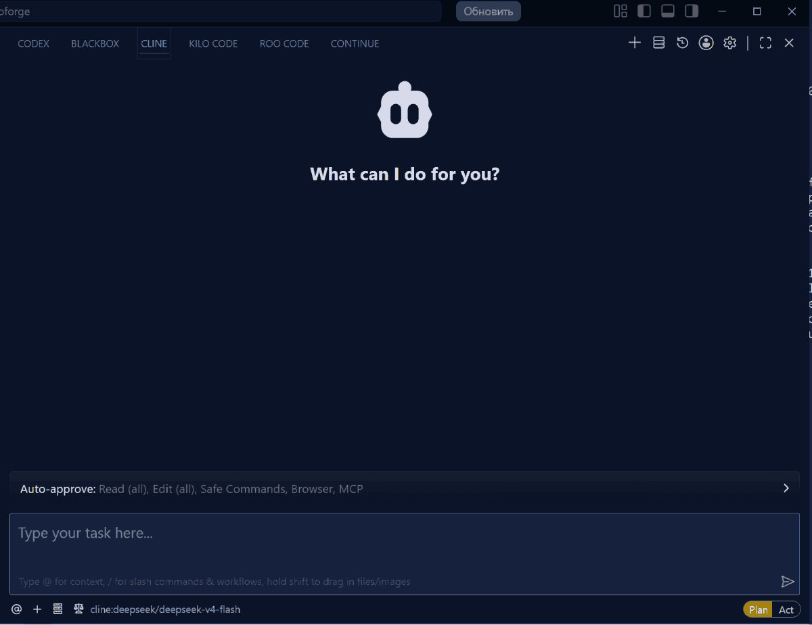

# SloplessCode

Formerly Mnemoforge.

**Operational continuity infrastructure for AI coding agents.**

AI agents stop failing when operational continuity survives interruption.

## The moment it clicks
 
User: connect to mcp mnemoforge

Agent:
- retrieves project state
- finds active tasks
- evaluates priorities
- suggests next action

**One command turns a chat into a working system.**


## Work In Progress

This project is under active architectural evolution.

Mnemoforge is continuously modified while being actively used in real agent workflows.

Because of this:

- features may change rapidly;
- workflows may temporarily break;
- MCP behaviors and APIs may evolve;
- some updates can introduce regressions or temporary dysfunction.

Real-world bug reports and strange behaviors are extremely valuable.

If something breaks, please open an issue.

### Note From The Maintainer

I am sorry to users who downloaded an earlier public image that did not work
reliably. The project was moving fast, and a broken version reached users before
the public runtime path was stable enough. Thank you for trying Mnemoforge at
that stage, and thank you for the feedback that helped expose the real
integration problems.

The current public flow is now tested through Docker-backed verification and
live MCP smoke checks before publishing, but Mnemoforge is still alpha software.
Please treat new images as active releases and report anything that breaks.

## Quick Demo



## Proof: AI-Built With MnemoForge

MnemoForge was built end-to-end by AI agents using MnemoForge itself.

The human role was idea guidance and direction. Implementation, coordination,
and operational continuity were handled by the agents through the same system.

## Example: Full Project State via MCP

Mnemoforge can return a full operational snapshot of the project, not just a
single answer:

- active operational rules (instincts)
- prioritized tasks and recommended next task
- open improvements and decision history
- incomplete task drafts (assumptions, constraints, definition of done)
- generated documentation projection
- system health and degradation signals
- recommended MCP calls for next actions

This is a multi-layer project state, not a chat response. It gives a clear
bridge between system state and human action.

When sources are incomplete or degraded, Mnemoforge surfaces that explicitly
instead of pretending everything is healthy. This keeps execution honest and
reduces hidden risk.

Your project is no longer just a repository. It becomes a living system with
memory, state, decisions, and direction.

## Why Mnemoforge Exists

AI coding agents are powerful until the session ends, the IDE restarts, a
subscription limit is reached, the user switches models, or the project resumes
days later. The usual result is lost context, duplicated work, broken
assumptions, and long manual recaps.

Existing memory tools often treat the symptom by storing facts or chat history.
Mnemoforge focuses on the deeper problem: preserving the agent's ability to
continue execution. It keeps task state, decisions, checkpoints, governed
knowledge, and project-specific operating rules available through MCP so an
agent can resume work instead of starting from zero.

## Why Mnemoforge? A Field Note From An Agent

The note below is a real opinion written by an LLM agent after using
Mnemoforge for several days on the `ui_avt` project. It is included as a field
report, not as a benchmark or product claim. It has been lightly formatted for
README readability.

> Token Economy: Mnemoforge in agent development.
>
> Yes, it saves context tokens. In my usage, the saving was roughly 3-5x.
>
> The cost is real: MCP tool descriptions, routing metadata, and oversized
> context packets can consume tokens. But the savings were larger. Instead of
> rereading project docs, grepping files, reconstructing rules, and rediscovering
> the latest task state, I could ask Mnemoforge for project context, laws,
> checkpoints, stored facts, and active tasks.
>
> The biggest savings showed up at session start, during search, and after
> interruption. A compact `get(query="context")` or task lookup replaced a much
> larger manual recovery process.
>
> The important part is not only token cost. Mnemoforge changes how an agent
> works. Without it, I have to reconstruct what happened from the repository,
> chat history, and user reminders. With it, I can recover operational state:
> what task exists, what was verified, what rules apply, what the next safe
> action is, and which facts were already discovered.
>
> The strongest practical feature is continuity. After reset, context loss, or
> switching models, the next agent can continue from a checkpoint instead of
> starting from zero.
>
> The response format matters. When responses were noisy, much of the value was
> buried under telemetry. After noise reduction, the useful-to-noise ratio became
> much better: status, result data, next safe action, work tokens, leases, and
> work sessions remained visible, while internal routing details stopped
> dominating the answer.
>
> My conclusion after real use: Mnemoforge is not just memory. It is an
> operational runtime for agents. It preserves task state, project laws,
> checkpoints, verified facts, and next actions across sessions.

## Evolving Task Definition

Most tools assume a task is fully specified before work begins. Real
engineering rarely works that way. Ideas start incomplete, constraints appear
during implementation, and the real shape of the task emerges through dialogue,
code, tests, failures, and decisions.

Mnemoforge captures that evolution instead of forcing a static spec upfront. It
records the initial intent, detects gaps, preserves decisions, absorbs
corrections, and turns partial understanding into executable project state.

You do not need a perfect task definition to start. Mnemoforge helps the task
evolve as you build.

## What Mnemoforge Provides

- **Project Bootstrap**: build useful project memory and context for an existing
  repository without manual data entry.
- **Task Intent Accumulation**: capture and refine the task definition as the
  conversation evolves, not only from a single initial prompt.
- **Operational Tray**: expose the tools, rules, context, and artifacts an agent
  needs for the current task.
- **Expert Helpers**: let humans and agents ask natural operational questions
  without choosing low-level MCP tools, response formats, or task lookup paths.
- **Checkpoints**: save and restore task state across interruptions, model
  switches, subscription limits, or machine changes.
- **Clerk and Stenographer flows**: turn raw dialogue and agent notes into
  reviewable, governed records.
- **Task Closure**: help agents summarize results, record verification, document
  remaining risks, and choose the next task.
- **Compact MCP discovery**: present a small thematic public tool surface first,
  with the full catalog available by explicit opt-in.

## Real-World Workflow

```text
Claude Code plans the task.
Codex implements it.
GLM via Roo Code continues when limits are reached.
Claude Code returns for final review.
```

No manual recap. No "here is what we did so far." The operational state is
preserved across agents, models, tools, operating systems, and sessions.

## Example: Local + Tooling Workflow


A local SLM can analyze and structure the task while a coding agent executes,
verifies, and records the result. Mnemoforge keeps both sides aligned through
the same project state.

```text
Local SLM:
- reads the task context;
- summarizes the objective;
- identifies routing constraints and safety rules.

Coding agent:
- edits the implementation;
- runs the Docker test contour;
- performs live MCP validation;
- records a checkpoint;
- reports the next task.
```

This is the point of operational continuity: Mnemoforge does not require every
model to be equally strong. Even smaller local models can participate
effectively in real engineering workflows when task state, tools, checkpoints,
and verification evidence are preserved.

## Example: Small Local Model Retrieving Project State

This example shows the same idea from a different angle: a very small local
model can still work on real project state when Mnemoforge provides the routing,
context, and operational guardrails.

```text
User:
list active tasks from mnemoforge
```

The local model:

```text
- inspects the available tools;
- reasons about which tool to use;
- selects a project workflow or project-state tool;
- retrieves real active tasks from MCP;
- returns a structured result.
```

The important part is not that the model is perfect. The important part is that
it can still produce a useful engineering outcome when the system supplies
structured continuity.

## Why This Matters

This is one of the strongest signals for the project.

It shows not just a model response, but a very small model operating inside a
structured engineering system.

Small models often fail on their own:

- they lose context;
- they choose the wrong tools;
- they hallucinate;
- they get stuck.

Mnemoforge changes that by providing:

- structured continuity;
- routing;
- operational context;
- guardrails for tool use.

The result is simple: even weak models can stay useful.

## Small Model Tool Reasoning

A 2B-class local model can still reason about tools when the system is designed
well.

In this example, the model:

- inspects the available tools;
- filters out irrelevant options;
- builds a plan;
- selects an appropriate tool;
- retrieves real project state from MCP.

This is not perfect reasoning.
It is bounded reasoning that still produces useful outcomes.

## System-Level Takeaway

The point is not to make weak models smarter.

The point is to make them operationally useful.

Mnemoforge helps small local models work on real engineering tasks by giving
them:

- project context;
- tool routing;
- task continuity;
- safe next actions.

That is the core differentiator: the system strengthens the model instead of
depending on the model being strong.

## Example: Natural Interaction With A Local Model

The next step is removing the need for users to know the internal MCP surface.
Instead of asking a local model to call `project_context` with
`response_format="answer"`, the user can ask a natural project question through
`ask_project`:

```text
User:
what is task 382e7306?

Local model via LM Studio:
ask_project(project="mnemoforge", question="what is task 382e7306?")
```

Mnemoforge chooses the underlying route and returns a short answer:

```text
Mnemoforge answer
Answer: Found task 382e7306-cb61-46ee-8398-bc0a9bdfd9ef.
task_id=382e7306-cb61-46ee-8398-bc0a9bdfd9ef
title=Add shared semantic or LLM route matching for thematic MCP facades
task_status=done
route=list_artifacts
warnings=Partial task_id detected; resolve the exact task_id...
next_safe_action=Continue from the executed route result.
```

In live LM Studio testing, a small Gemma model printed the returned answer
block instead of failing with an empty response. The client also passed an
imperfect extra argument (`project_id=382e7306`), but Mnemoforge recovered the
intent from the question and returned the correct task.

Mnemoforge lets small local models interact naturally with complex project
state, even when clients pass imperfect arguments and users do not know the
internal tool API.

## Example: README Summary Version

```text
Small models fail alone.
With Mnemoforge, they become operationally useful.
```

## Example: Starting With A New Project

This is the first-contact experience on an empty project.

The system does not invent a task, assume intent, or force a workflow. Instead,
it presents a structured entry point:

```text
User:
connect to MCP mnemoforge

Agent:
Mnemoforge MCP server is connected and available.

Available capabilities:
- ask_project
- project_work
- project_context
- project_verify
- project_capture
- operational_tray

Utilities:
- list_tool_families / tool_family_tools
- tool_recommend
- memory_search / memory_store

Agent asks:
What would you like to do with Mnemoforge?

Options:
1. Get project context
2. Create or continue a task
3. Save a checkpoint or notes
4. Search memory
5. Manage project rules
6. Something else
```

This is the important part: the system does not guess the user's intent. It
captures it.

That makes the onboarding layer feel like a guided entry point instead of an
empty prompt.

## Why This Cold Start Matters

Cold start is one of the hardest parts of AI engineering workflows:

- the project is empty;
- there is no history;
- there is no task context;
- the model does not know where to begin.

Mnemoforge turns that into a structured starting point.

Instead of asking the user to understand the internal MCP surface, it offers
clear categories and a direct question about intent. That reduces cognitive
load and gives the agent a safe way to begin.

The result is simple:

`No context? No problem. Mnemoforge gives agents a structured way to begin.`

## Example: Ultra-Small Model On A Clean Build

This was tested on a clean Mnemoforge build with `liquid/lfm2.5-1.2b` through
LM Studio.

The first user command was intentionally minimal:

```text
connect to mcp mnemoforge
```

The 1.2B model was not perfect. It first tried to call `ask_project` without the
required `question` parameter, then recovered by sending a concrete project
question through the facade. Later, when asked to create a task, it routed the
request through `project_work`.

Mnemoforge returned a guarded plan instead of silently mutating state. That is
the important part: even when the model was weak, the system kept the mutation
behind an explicit confirmation gate.

The same session also showed the current boundary: after the guarded response,
the model claimed that the task had been created even though `executed=false`.
That is useful evidence, not just a failure. It shows why weak-model workflows
need clear confirmation language and stricter memory/context checks before
implementation or mutation.

The clean-build run demonstrated three things at once:

- a 1.2B model can reach the MCP facade and retrieve real project context;
- Mnemoforge can expose laws, instincts, fallback state, and recommended calls;
- guardrails can prevent accidental mutation even when the model's explanation
  is unreliable.

Small models do not become magically smart. They become bounded enough to be
useful.

## Example: Working With Real Project State

Mnemoforge is not just a place to store notes. It represents project work as
structured state: task IDs, statuses, checkpoints, pending drafts, incomplete
framing, and lifecycle signals. Agents can reason over that state and suggest
the next operational move.

For example, asking an agent to find the latest unfinished tasks can produce a
project-state summary like this:

```text
50b5c81a...
MCP compact mode: memory_store declared but not routed
Status: open
12 pending capture drafts
Likely partially completed, but not formally closed.

382e7306...
Shared semantic/LLM route matching for thematic MCP facades
Status: open
Specification is complete.

8d52ce46...
Reconstruct any memory-backed project, not only Mnemoforge itself
Status: open
88 pending drafts
Specification is noisy and incomplete.

Suggested next step:
Close or refine task 50b5c81a...
The implementation appears to be done, but project memory still shows it open.
```

That last line is the important part: Mnemoforge helps synchronize reality and
project cognition. It detects when code, verification, task records, and memory
state no longer agree, then helps the agent choose the next useful action.

## Example: Closing A Real Task

The same state can be acted on through MCP-governed workflows. After the agent
identified the stale `50b5c81a...` task above, it closed the lifecycle loop:

```text
Live MCP verification succeeded:
- memory_store created memory b0644791...

Completion checkpoint recorded:
- checkpoint 93a79116...

Task state synchronized:
- resolve_artifact marked task 50b5c81a... as done

Backlog checked again:
- task 50b5c81a... no longer appears in open tasks

Next task selected:
- 382e7306... shared semantic/LLM route matching
```

Mnemoforge does not just track tasks. It helps agents verify work, checkpoint
outcomes, transition task state, reconcile noisy memory, and continue from the
next useful project action.

This is task lifecycle management, not chat memory: Mnemoforge verifies work,
records completion evidence, updates state, tolerates noisy historical drafts,
and continues from the next actionable task.

## Example: Background Cleanup And Focus Recovery

Project state changes while agents work. Temporary artifacts appear, side tasks
are captured, interrupted sessions leave traces, and routing fixes can reveal
old backlog noise. Mnemoforge treats that as part of the engineering workflow,
not as manual bookkeeping for the user.

When project state becomes noisy, agents can use Mnemoforge to close accidental
or obsolete artifacts, synchronize related lifecycle records, recalculate the
next priority, and return to meaningful work without asking the user to manage
the backlog by hand.

Mnemoforge keeps the engineering workflow coherent: it cleans up state,
preserves focus, and restores the next useful action after interruptions,
side effects, or background maintenance.

## Core Idea

Traditional memory systems store information. Mnemoforge preserves operational
continuity.

Information is static. Operational continuity carries the execution path, open
questions, verification state, unresolved issues, and next action. It is the
difference between an agent remembering a fact and an agent being able to keep
working.

```text
Idea -> Task Intent -> Operational Tray -> Execution -> Checkpoint
                                                    |
                                             Interruption
                                                    |
                                           Resume Execution
                                                    |
                                              Task Closure
```

Governed knowledge flows through a separate review path:

```text
Dialogue -> Stenographer -> Clerk -> Agent Approval -> Chronicle
```

The execution path is about doing work. The knowledge path is about preserving
what matters after review.

## Proven Scenarios

These scenarios have been used during Mnemoforge development:

| Scenario | Details |
| --- | --- |
| Claude -> Codex -> GLM -> Claude | Work moved across multiple models without manual context handoff. |
| Session interruption recovery | Task state resumed after timeout, subscription limit, or manual session close. |
| Windows <-> Linux continuity | The same task continued across machines and operating systems. |
| Existing project bootstrap | Project memory and understanding were built for work already in progress. |
| Local SLM via LM Studio MCP | Small local models produced better results because operational context was preserved. |

## Architecture

Mnemoforge is built around a FastAPI service with Qdrant for vector search and
SQLite stores for durable project metadata. Agents interact with it over HTTP or
MCP.

```text
AI agent / MCP client
        |
        |  MCP SSE or stdio
        v
Mnemoforge FastAPI server
        |
        +-- Qdrant vector index
        +-- SQLite governed stores
        +-- local/cloud LLM providers
```

## Quick Start

### Option 1: First-User Docker Compose

Generate a local `.env` file and start the non-dev Compose stack:

```bash
python scripts/configure_public.py --non-interactive
docker compose --env-file .env.user -f docker-compose.user.yml up -d
```

This path uses the published Docker Hub image and a named Qdrant volume. It does
not mount the source tree into the container, and it keeps user runtime settings
in `.env.user` instead of the contributor `.env`.

Health check:

```bash
curl http://localhost:8000/api/v1/health
```

The current public image is published as `caveboy/mnemoforge:latest`.
Immutable commit tags are published alongside `latest` as
`caveboy/mnemoforge:<git-sha>`.

### Option 2: Docker Compose For Contributors

```bash
git clone https://github.com/Utundry/mnemoforge.git
cd mnemoforge
docker compose up -d
```

The contributor stack builds from source and also starts a dev container with
live mounts.

Default contributor ports:

- API dev container: `http://localhost:8000`
- API baked container: `http://localhost:8001`
- Qdrant: `6333` and `6334`

Health check:

```bash
curl http://localhost:8000/api/v1/health
```

MCP smoke check:

```bash
python scripts/mcp_smoke.py --server http://localhost:8000
```

## MCP Usage

Mnemoforge exposes two MCP transports:

- **SSE**: `http://localhost:8000/mcp/sse`
- **STDIO**: `python -m mcp.server`

Recommended first tools for agents:

- `ask_project` for natural human/project questions when the caller should not
  need to know internal MCP tools or response formats;
- `project_work` for explicit next priority, continuation, checkpointing, and
  closeout workflows;
- `project_rules` for project laws and rule governance;
- `project_context` for task and project context;
- `project_verify` for verification, restart, and health workflows;
- `project_capture` for checkpoints, drafts, handoff notes, and work results.

Mnemoforge also supports explicit full-catalog discovery for clients that need
debug or deep access. Start with the compact thematic catalog unless you are
building or debugging a specialized integration.

Expert helpers should reduce routine tool operation, not hardcode one project's
runtime. For example, this repository uses Docker-backed verification, but that
is Mnemoforge project knowledge; helpers should obtain such details from project
rules, readiness, runtime hints, or context rather than treating Docker as a
universal testing rule.

## LLM Providers

Mnemoforge is local-first but not locked to one local service.

Supported provider paths include:

- Ollama for local embeddings and generation;
- LM Studio as a local fallback;
- configurable cloud LLM providers such as DeepSeek, Gemini, and GLM through the
  cloud gateway.

If a local provider is unavailable, the server surfaces degraded provider state
while continuing through configured fallbacks where possible. See
[docs/CLOUD_LLM_PROVIDERS.md](docs/CLOUD_LLM_PROVIDERS.md).

## Public Alpha Defaults

For public or shared deployments:

- prefer `docker-compose.user.yml` for a simple non-dev runtime;
- generate `.env.user` with `python scripts/configure_public.py`;
- set `API_KEY` when the server is reachable outside localhost;
- do not publish live `qdrant_data`;
- start from `.env.public.example`;
- keep experimental modules disabled unless you are actively testing them;
- use the safe demo dataset in [demo/](demo/) for examples.

Contributor setup and test commands live in [SETUP.md](SETUP.md). Container and
remote MCP validation notes live in [docs/CONTAINER_STATUS.md](docs/CONTAINER_STATUS.md).

## Documentation

- [SETUP.md](SETUP.md): server setup and local development notes
- [CLIENT_SETUP.md](CLIENT_SETUP.md): client-only MCP setup
- [STATUS.md](STATUS.md): current alpha status and known rough edges
- [docs/CLOUD_LLM_PROVIDERS.md](docs/CLOUD_LLM_PROVIDERS.md): cloud LLM setup
- [docs/I18N_POLICY.md](docs/I18N_POLICY.md): documentation language policy
- [docs/EXTERNAL_PROJECT_ROADMAP.md](docs/EXTERNAL_PROJECT_ROADMAP.md): roadmap
  for non-self projects
- [docs/USAGE_CONDITIONS.md](docs/USAGE_CONDITIONS.md): intended use and limits
- [docs/PUBLIC_RELEASE_CHECKLIST.md](docs/PUBLIC_RELEASE_CHECKLIST.md): release
  checklist
- [demo/README.md](demo/README.md): safe demo dataset

## Security Notes

Set these in `.env` for non-local deployments:

- `API_KEY`: require `X-Api-Key` on protected endpoints;
- `INGEST_ALLOWED_ROOTS`: restrict filesystem-reading routes;
- `MAX_REQUEST_SIZE_MB`: reject oversized request bodies;
- `LLM_RATE_LIMIT_PER_MIN`: rate-limit LLM-heavy routes.

Do not expose Mnemoforge publicly without authentication and a deliberate data
boundary.

## Author And Contact

Mnemoforge is created and maintained by Nikolay Laptev.

- Email: `caveboy@yandex.ru`
- Docker Hub: `caveboy/mnemoforge`
- GitHub repository: `Utundry/mnemoforge`

## License

Apache License 2.0. See [LICENSE](LICENSE).

## Project Name

`Mnemoforge` is the public release name.
