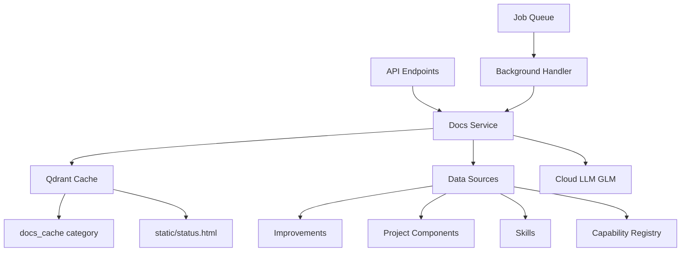

# Living Documentation Implementation Plan

## Обзор

Система автоматической генерации и актуализации документации проекта mnemoforge на основе данных из Qdrant.

### Цель

Агент в любой момент может вызвать `GET /docs/status` и получить актуальную картину состояния проекта — что реализовано, что в планах, какие компоненты есть, какие модели что умеют.

---

## Архитектура



---

## Компоненты

### 1. API Эндпоинты (`app/routers/docs.py`)

| Метод | Эндпоинт | Описание |
|-------|----------|----------|
| POST | `/docs/rebuild` | Запуск фонового пересборки документации |
| GET | `/docs/status` | JSON документация (LLM-ready) |
| GET | `/docs/status.html` | Интерактивный SPA-дашборд (статичный HTML+JS) |
| GET | `/docs/status.md` | Markdown документация |
| GET | `/docs/section/{name}` | Отдельная секция документа |

### 2. Секции документа

| Секция | Тип генерации | Источник данных |
|--------|---------------|----------------|
| `overview` | GLM (prose) | Все источники |
| `features` | Детерминированная | Improvements (resolved) |
| `pending` | Детерминированная | Improvements (open) |
| `architecture` | GLM (синтез) | Project components |
| `skills` | Детерминированная | Skills marketplace |
| `performance` | Детерминированная | Capability registry |

### 3. Источники данных

- `improvement` — список улучшений (открытые/закрытые) с приоритетами
- `project_component` — компоненты из project knowledge cache
- `skill` — маркетплейс скилов (статистика, домены)
- `skill_evolution_log` — история эволюции
- `capability registry (SQLite)` — статистика производительности моделей

---

## План реализации

### Шаг 1: Pydantic модели

**Файл:** `app/models/docs.py`

```python
class DocsStatus(BaseModel):
    """Полный статус документации"""
    project: str
    generated_at: datetime
    sections: dict[str, DocsSection]
    cache_ttl: int  # секунды

class DocsSection(BaseModel):
    """Отдельная секция документа"""
    name: str
    content: str
    generated_at: datetime

class DocsRebuildRequest(BaseModel):
    """Запрос на пересборку документации"""
    project: str = Field(default="mnemoforge")
    force: bool = Field(default=False)  # игнорировать кэш
```

### Шаг 2: Сервис документации

**Файл:** `app/services/docs_service.py`

```python
class DocsService:
    """Сервис генерации и кэширования документации"""

    def __init__(
        self,
        qdrant: AsyncQdrantClient,
        ollama: OllamaService,
        job_queue: JobQueue
    ):
        self._q = qdrant
        self._ollama = ollama
        self._job_queue = job_queue

    async def rebuild_docs(self, project: str) -> str:
        """Пересобрать документацию (фоновая задача)"""

    async def get_docs_status(self, project: str) -> DocsStatus:
        """Получить статус документации из кэша"""

    async def get_docs_markdown(self, project: str) -> str:
        """Получить Markdown документацию"""

    async def get_section(self, project: str, name: str) -> DocsSection:
        """Получить отдельную секцию"""

    # --- Генераторы секций ---

    async def _generate_overview(self, data: dict) -> str:
        """GLM: prose-нарратив"""

    async def _generate_features(self, data: dict) -> str:
        """Детерминированная агрегация"""

    async def _generate_pending(self, data: dict) -> str:
        """Детерминированная агрегация"""

    async def _generate_architecture(self, data: dict) -> str:
        """GLM: синтез компонентов"""

    async def _generate_skills(self, data: dict) -> str:
        """Детерминированная агрегация"""

    async def _generate_performance(self, data: dict) -> str:
        """Детерминированная агрегация"""
```

### Шаг 3: API Роутер

**Файл:** `app/routers/docs.py`

```python
router = APIRouter(prefix="/docs", tags=["docs"])

@router.post("/rebuild")
async def rebuild_docs(
    request: DocsRebuildRequest,
    job_queue: JobQueueDep
) -> dict:
    """Запуск фонового пересборки документации"""

@router.get("/status")
async def get_docs_status(
    project: str = Query(default="mnemoforge"),
    docs_svc: DocsServiceDep
) -> DocsStatus:
    """Получить JSON документацию"""

@router.get("/status.html")
async def get_docs_html() -> FileResponse:
    """Отдать статичный SPA-дашборд (JS сам загружает данные через /docs/status)"""
    return FileResponse("static/status.html")

@router.get("/status.md")
async def get_docs_markdown(
    project: str = Query(default="mnemoforge"),
    docs_svc: DocsServiceDep
) -> PlainTextResponse:
    """Получить Markdown документацию"""

@router.get("/section/{name}")
async def get_section(
    name: str,
    project: str = Query(default="mnemoforge"),
    docs_svc: DocsServiceDep
) -> DocsSection:
    """Получить отдельную секцию"""
```

### Шаг 4: Интеграция в main.py

```python
# Добавить импорт
from app.routers import docs

# Добавить роутер
app.include_router(docs.router)

# Зарегистрировать handler в lifespan
job_queue.register("docs_rebuild", _docs_rebuild_handler)
```

### Шаг 5: Background Handler

```python
async def _docs_rebuild_handler(payload: dict) -> dict:
    """Handler для фонового пересборки документации"""
    project = payload.get("project", "mnemoforge")
    force = payload.get("force", False)

    docs_svc = get_docs_service()
    await docs_svc.rebuild_docs(project, force=force)

    return {"status": "done", "project": project}
```

### Шаг 6: Кэширование

**Хранение на диске:**
- Файл: `qdrant_data/docs_cache/{project}.json`
- Без TTL — инвалидация только по событиям
- Простой key-value по имени проекта, без Qdrant (embedding не нужен)

**HTML дашборд:**
- Файл: `static/status.html` — статичный SPA-шаблон, не генерируется сервером
- JS в браузере тянет данные через `GET /docs/status` (JSON)
- Кнопка Rebuild → `POST /docs/rebuild` → polling `GET /tasks/{job_id}`
- Секции рендерятся через `marked.js` (Markdown → HTML)
- Auto-refresh: показываем `generated_at` + кнопку ручного обновления
- Отдаётся через `FileResponse("static/status.html")` из роутера

### Шаг 7: Автотриггеры

```python
# В improvements.py после resolve
async def resolve_improvement(...):
    # ... существующий код ...
    # Триггер пересборки документации
    job_queue = get_job_queue()
    await job_queue.submit("docs_rebuild", {"project": project})

# В project.py после ingest/refresh
async def _ingest_handler(payload: dict) -> dict:
    # ... существующий код ...
    # Триггер пересборки документации
    await job_queue.submit("docs_rebuild", {"project": project_id})
```

---

## Стратегия генерации

### Детерминированные секции (~5 сек)

- `features`: агрегация resolved improvements
- `pending`: агрегация open improvements
- `skills`: статистика из skills marketplace
- `performance`: агрегация из capability registry

### GLM секции (~15 сек)

- `overview`: prose-нарратив на основе всех данных
- `architecture`: синтез компонентов в связное описание

**Итого:** ~20 сек вместо ~120 сек (если бы все секции через LLM)

---

## Кэширование

### Стратегия инвалидации

- **Без TTL** — кэш валиден до следующего изменяющего события
- **Event-driven invalidation:** кэш удаляется и пересобирается только при изменениях проекта
- **Force rebuild:** через параметр `force=true` (удаляет кэш перед rebuild)

### Автообновление (события-триггеры)

- После `PATCH /improvements/{id}/resolve`
- После `POST /project/ingest` (только изменённые компоненты)
- После `POST /project/refresh` (только изменённые компоненты)

---

## Зависимости

### Новые зависимости

Нет (используем существующие: FastAPI, Qdrant, Cloud LLM)

### Существующие сервисы

- `QdrantService` — источник данных (improvements, skills, project components)
- `JobQueue` — фоновые задачи
- `CloudLLM` (`cloud_complete` / `cloud_available`) — GLM для секций overview и architecture
- `CapabilityRegistry` — статистика производительности для секции performance
- Файловый кэш `qdrant_data/docs_cache/` — хранение сгенерированной документации

---

## Тестирование

### Unit тесты

- Тесты генерации каждой секции
- Тесты кэширования
- Тесты TTL логики

### Интеграционные тесты

- POST `/docs/rebuild` → job_id
- GET `/tasks/{job_id}` → status: done
- GET `/docs/status` → валидный JSON
- GET `/docs/status.html` → валидный HTML
- GET `/docs/status.md` → валидный Markdown

---

## Файлы для создания/модификации

### Новые файлы

1. `app/models/docs.py` — Pydantic модели
2. `app/services/docs_service.py` — сервис документации
3. `app/routers/docs.py` — API роутер
4. `static/status.html` — SPA-дашборд (статичный HTML + JS, данные через `/docs/status`)
5. `tests/test_docs.py` — тесты

### Модификация существующих файлов

1. `app/main.py` — интеграция роутера и handler
2. `app/routers/improvements.py` — автотриггер после resolve
3. `app/routers/project.py` — автотриггер после ingest/refresh
4. `app/dependencies.py` — добавить DocsServiceDep

---

## Приоритеты

### P0 (Критично)

- Pydantic модели
- DocsService базовая реализация
- API эндпоинты (status, rebuild)
- Кэширование в Qdrant

### P1 (Важно)

- HTML/Markdown генерация
- Автотриггеры
- Фоновый handler

### P2 (Желательно)

- Отдельные секции
- TTL логика
- Тесты

---

## Риски и митигации

| Риск | Митигация |
|------|-----------|
| GLM недоступен | Fallback на детерминированные секции |
| Кэш устарел | Stale-while-revalidate стратегия |
| Долгая генерация | Фоновая задача через JobQueue |
| Ошибки в данных | Graceful degradation, логирование |

---

## Метрики успеха

- Время генерации: < 30 сек
- Кэш hit rate: > 90%
- API latency (cached): < 100ms
- Успешность автотриггеров: 100%
