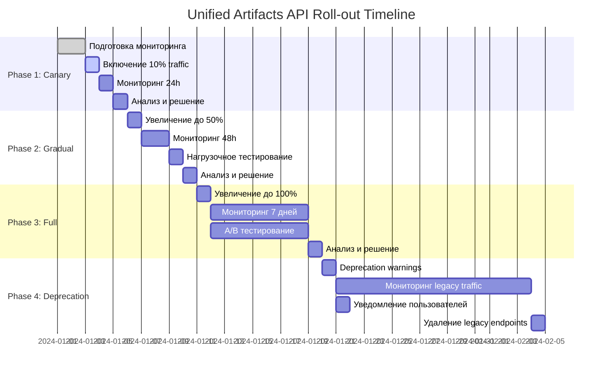
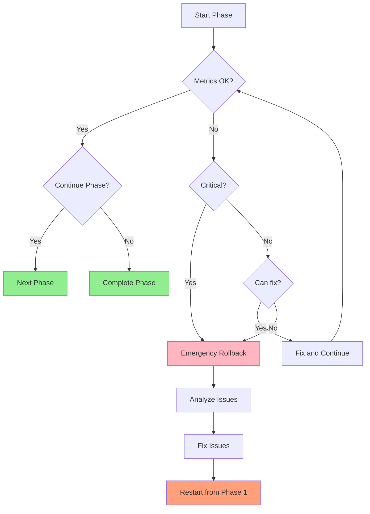

# Детальная Roll-out стратегия для Unified Artifacts API

## Обзор

Roll-out стратегия описывает поэтапное внедрение унифицированного API для improvements и tasks. Цель - минимизировать риски и обеспечить плавный переход для пользователей.

## Архитектура Feature Flags

```python
# app/config.py
class Settings:
    # Feature flag для unified artifacts API
    UNIFIED_ARTIFACTS_ENABLED: bool = os.getenv(
        "UNIFIED_ARTIFACTS_ENABLED",
        "false"
    ).lower() == "true"

    # Процент трафика для canary (0-100)
    UNIFIED_ARTIFACTS_CANARY_PERCENT: int = int(
        os.getenv("UNIFIED_ARTIFACTS_CANARY_PERCENT", "10")
    )

    # Список user IDs для canary тестирования
    UNIFIED_ARTIFACTS_CANARY_USERS: list[str] = json.loads(
        os.getenv("UNIFIED_ARTIFACTS_CANARY_USERS", "[]")
    )
```

```python
# app/middleware/feature_flags.py
async def unified_artifacts_enabled(request: Request) -> bool:
    """Проверить, включен ли unified artifacts API для текущего запроса."""
    if not settings.UNIFIED_ARTIFACTS_ENABLED:
        return False

    # Canary проверка по user ID
    user_id = request.headers.get("X-User-ID")
    if user_id in settings.UNIFIED_ARTIFACTS_CANARY_USERS:
        return True

    # Canary проверка по проценту трафика
    if settings.UNIFIED_ARTIFACTS_CANARY_PERCENT > 0:
        # Хэш user ID для детерминированного распределения
        hash_value = int(hashlib.md5(user_id.encode()).hexdigest(), 16)
        canary_threshold = (settings.UNIFIED_ARTIFACTS_CANARY_PERCENT / 100) * (2**32)
        return hash_value < canary_threshold

    return False
```

## Phase 1: Canary (10% traffic)

### Цель
Проверить стабильность на небольшом объеме трафика перед масштабированием.

### Подготовка

#### 1. Настройка мониторинга

```python
# app/monitoring/unified_artifacts.py
from prometheus_client import Counter, Histogram, Gauge

# Метрики
unified_artifacts_requests_total = Counter(
    'unified_artifacts_requests_total',
    'Total requests to unified artifacts API',
    ['endpoint', 'method', 'status']
)

unified_artifacts_request_duration = Histogram(
    'unified_artifacts_request_duration_seconds',
    'Request duration for unified artifacts API',
    ['endpoint', 'method'],
    buckets=[0.005, 0.01, 0.025, 0.05, 0.1, 0.25, 0.5, 1.0, 2.5, 5.0, 10.0]
)

unified_artifacts_sync_errors_total = Counter(
    'unified_artifacts_sync_errors_total',
    'Total sync errors between improvements and tasks',
    ['direction', 'error_type']
)

unified_artifacts_active_connections = Gauge(
    'unified_artifacts_active_connections',
    'Active database connections for unified artifacts'
)
```

#### 2. Настройка алертов

```yaml
# prometheus/alerts.yml
groups:
  - name: unified_artifacts
    rules:
      # High error rate
      - alert: UnifiedArtifactsHighErrorRate
        expr: |
          rate(unified_artifacts_requests_total{status=~"5.."}[5m])
          /
          rate(unified_artifacts_requests_total[5m])
          > 0.01
        for: 5m
        labels:
          severity: critical
        annotations:
          summary: "High error rate in unified artifacts API"
          description: "Error rate is {{ $value | humanizePercentage }}"

      # High latency
      - alert: UnifiedArtifactsHighLatency
        expr: |
          histogram_quantile(0.95,
            rate(unified_artifacts_request_duration_seconds_bucket[5m])
          ) > 0.2
        for: 5m
        labels:
          severity: warning
        annotations:
          summary: "High latency in unified artifacts API"
          description: "P95 latency is {{ $value }}s"

      # Sync errors
      - alert: UnifiedArtifactsSyncErrors
        expr: |
          rate(unified_artifacts_sync_errors_total[5m]) > 0.1
        for: 5m
        labels:
          severity: warning
        annotations:
          summary: "High sync error rate"
          description: "Sync error rate is {{ $value }}/s"
```

#### 3. Настройка логирования

```python
# app/logging/unified_artifacts.py
import logging
import json
from datetime import datetime

logger = logging.getLogger("unified_artifacts")

class UnifiedArtifactsLogger:
    """Структурированный логгер для unified artifacts."""

    @staticmethod
    def log_sync_operation(
        direction: str,  # "improvement_to_task" или "task_to_improvement"
        source_id: str,
        target_id: str,
        old_status: str,
        new_status: str,
        success: bool,
        error: str | None = None,
    ):
        logger.info(
            json.dumps({
                "event": "sync_operation",
                "timestamp": datetime.utcnow().isoformat(),
                "direction": direction,
                "source_id": source_id,
                "target_id": target_id,
                "old_status": old_status,
                "new_status": new_status,
                "success": success,
                "error": error,
            })
        )

    @staticmethod
    def log_edge_case(
        case_type: str,
        artifact_id: str,
        details: dict,
    ):
        logger.warning(
            json.dumps({
                "event": "edge_case",
                "timestamp": datetime.utcnow().isoformat(),
                "case_type": case_type,
                "artifact_id": artifact_id,
                "details": details,
            })
        )
```

### Выполнение

#### 1. Включение feature flag для 10% пользователей

```bash
# Установить переменные окружения
export UNIFIED_ARTIFACTS_ENABLED=true
export UNIFIED_ARTIFACTS_CANARY_PERCENT=10

# Перезапустить сервис
systemctl restart mnemoforge-api
```

#### 2. Мониторинг в течение 24 часов

**Метрики для наблюдения:**

| Метрика | Цель | Критическое значение |
|---------|------|---------------------|
| Error rate | < 0.1% | > 1% |
| Latency p95 | < 100ms | > 200ms |
| Latency p99 | < 500ms | > 1000ms |
| Sync error rate | < 0.01/s | > 0.1/s |
| DB connections | < 80% pool | > 90% pool |

**Логи для наблюдения:**

```bash
# Просмотр sync операций
grep "sync_operation" /var/log/mnemoforge/unified_artifacts.log | jq .

# Просмотр edge cases
grep "edge_case" /var/log/mnemoforge/unified_artifacts.log | jq .

# Просмотр ошибок
grep "ERROR" /var/log/mnemoforge/unified_artifacts.log | tail -100
```

#### 3. Ежедневный отчет

```python
# scripts/generate_canary_report.py
import requests
from datetime import datetime, timedelta

def generate_canary_report():
    """Сгенерировать отчет за последние 24 часа."""

    # Получить метрики из Prometheus
    end_time = datetime.utcnow()
    start_time = end_time - timedelta(hours=24)

    # Error rate
    error_rate = query_prometheus(
        f'rate(unified_artifacts_requests_total{{status=~"5.."}}[5m]) '
        f'/ rate(unified_artifacts_requests_total[5m])',
        start_time,
        end_time,
    )

    # Latency p95
    latency_p95 = query_prometheus(
        f'histogram_quantile(0.95, '
        f'rate(unified_artifacts_request_duration_seconds_bucket[5m]))',
        start_time,
        end_time,
    )

    # Sync errors
    sync_errors = query_prometheus(
        f'rate(unified_artifacts_sync_errors_total[5m])',
        start_time,
        end_time,
    )

    # Edge cases
    edge_cases = query_logs(
        "edge_case",
        start_time,
        end_time,
    )

    report = {
        "period": {
            "start": start_time.isoformat(),
            "end": end_time.isoformat(),
        },
        "metrics": {
            "error_rate": error_rate,
            "latency_p95": latency_p95,
            "sync_errors": sync_errors,
        },
        "edge_cases": edge_cases,
        "recommendations": generate_recommendations(
            error_rate, latency_p95, sync_errors
        ),
    }

    return report

def generate_recommendations(error_rate, latency_p95, sync_errors):
    """Сгенерировать рекомендации на основе метрик."""
    recommendations = []

    if error_rate > 0.001:
        recommendations.append(
            "⚠️ Error rate выше целевого значения. "
            "Рассмотрите откат или увеличение canary периода."
        )

    if latency_p95 > 0.1:
        recommendations.append(
            "⚠️ Latency p95 выше целевого значения. "
            "Проверьте производительность БД и кэша."
        )

    if sync_errors > 0.01:
        recommendations.append(
            "⚠️ Sync error rate выше целевого значения. "
            "Проверьте логи для выявления проблемных сценариев."
        )

    if not recommendations:
        recommendations.append("✅ Все метрики в норме. Можно переходить к Phase 2.")

    return recommendations
```

### Критерии успеха

| Метрика | Цель | Статус |
|---------|------|--------|
| Error rate | < 0.1% | ✅ PASS / ❌ FAIL |
| Latency p95 | < 100ms | ✅ PASS / ❌ FAIL |
| Latency p99 | < 500ms | ✅ PASS / ❌ FAIL |
| Sync error rate | < 0.01/s | ✅ PASS / ❌ FAIL |
| DB connections | < 80% pool | ✅ PASS / ❌ FAIL |
| Нет критических ошибок в логах | - | ✅ PASS / ❌ FAIL |

### Критические проблемы

| Проблема | Порог | Действие |
|----------|-------|----------|
| Error rate | > 1% | Отключить feature flag |
| Latency p95 | > 200ms | Отключить feature flag |
| Latency p99 | > 1000ms | Отключить feature flag |
| Sync error rate | > 0.1/s | Отключить feature flag |
| DB connections | > 90% pool | Отключить feature flag |
| Критические ошибки в логах | Любые | Отключить feature flag |

### Действия при проблемах

```python
# scripts/emergency_rollback.py
import os
import requests

def emergency_rollback():
    """Экстренный откат unified artifacts API."""

    # 1. Отключить feature flag
    os.environ["UNIFIED_ARTIFACTS_ENABLED"] = "false"

    # 2. Перезапустить сервис
    os.system("systemctl restart mnemoforge-api")

    # 3. Отправить уведомление
    send_slack_notification(
        "🚨 Unified Artifacts API отключен из-за критических проблем. "
        "Проверьте логи и метрики."
    )

    # 4. Создать incident
    create_incident(
        title="Unified Artifacts API emergency rollback",
        severity="critical",
        description="API отключен из-за критических проблем.",
    )

    print("✅ Emergency rollback выполнен")
```

## Phase 2: Gradual (50% traffic)

### Цель
Проверить масштабируемость при увеличении нагрузки.

### Подготовка

#### 1. Увеличение canary до 50%

```bash
export UNIFIED_ARTIFACTS_CANARY_PERCENT=50
systemctl restart mnemoforge-api
```

#### 2. Дополнительный мониторинг

```python
# Дополнительные метрики для Phase 2
unified_artifacts_cache_hit_rate = Gauge(
    'unified_artifacts_cache_hit_rate',
    'Cache hit rate for unified artifacts API'
)

unified_artifacts_db_query_duration = Histogram(
    'unified_artifacts_db_query_duration_seconds',
    'Database query duration for unified artifacts API',
    ['query_type'],
    buckets=[0.001, 0.005, 0.01, 0.025, 0.05, 0.1, 0.25, 0.5, 1.0]
)

unified_artifacts_memory_usage = Gauge(
    'unified_artifacts_memory_usage_bytes',
    'Memory usage for unified artifacts API'
)
```

### Выполнение

#### 1. Мониторинг в течение 48 часов

**Дополнительные метрики:**

| Метрика | Цель | Критическое значение |
|---------|------|---------------------|
| Cache hit rate | > 80% | < 50% |
| DB query time (p95) | < 10ms | > 25ms |
| Memory usage | < 100MB | > 200MB |

#### 2. Нагрузочное тестирование

```python
# tests/load_test_unified_artifacts.py
import asyncio
import aiohttp
import statistics
from datetime import datetime

async def load_test_get_artifact(concurrency=10, duration=60):
    """Нагрузочное тестирование get_artifact."""

    async with aiohttp.ClientSession() as session:
        start_time = datetime.utcnow()
        end_time = start_time + timedelta(seconds=duration)

        latencies = []
        errors = 0

        async def worker():
            while datetime.utcnow() < end_time:
                try:
                    req_start = datetime.utcnow()
                    async with session.get(
                        "/artifacts/improvement:mnemoforge:abc"
                    ) as response:
                        await response.text()
                        req_end = datetime.utcnow()
                        latencies.append(
                            (req_end - req_start).total_seconds()
                        )
                except Exception as e:
                    errors += 1

        # Запустить workers
        tasks = [worker() for _ in range(concurrency)]
        await asyncio.gather(*tasks)

        # Статистика
        return {
            "total_requests": len(latencies) + errors,
            "successful_requests": len(latencies),
            "failed_requests": errors,
            "error_rate": errors / (len(latencies) + errors),
            "latency_p50": statistics.median(latencies),
            "latency_p95": statistics.quantiles(latencies, n=20)[18],
            "latency_p99": statistics.quantiles(latencies, n=100)[98],
        }

# Запустить тест
results = asyncio.run(load_test_get_artifact(concurrency=50, duration=300))
print(json.dumps(results, indent=2))
```

### Критерии успеха

| Метрика | Цель | Статус |
|---------|------|--------|
| Error rate | < 0.05% | ✅ PASS / ❌ FAIL |
| Latency p95 | < 80ms | ✅ PASS / ❌ FAIL |
| Latency p99 | < 400ms | ✅ PASS / ❌ FAIL |
| Cache hit rate | > 80% | ✅ PASS / ❌ FAIL |
| DB query time (p95) | < 10ms | ✅ PASS / ❌ FAIL |
| Memory usage | < 100MB | ✅ PASS / ❌ FAIL |

## Phase 3: Full (100% traffic)

### Цель
Полный roll-out на всех пользователей.

### Подготовка

#### 1. Увеличение canary до 100%

```bash
export UNIFIED_ARTIFACTS_CANARY_PERCENT=100
systemctl restart mnemoforge-api
```

#### 2. Удаление canary логики

```python
# После успешного Phase 3 можно упростить код
# app/middleware/feature_flags.py
async def unified_artifacts_enabled(request: Request) -> bool:
    """После Phase 3 всегда возвращаем True."""
    return True
```

### Выполнение

#### 1. Мониторинг в течение 7 дней

**Метрики для наблюдения:**

| Метрика | Цель | Критическое значение |
|---------|------|---------------------|
| Error rate | < 0.01% | > 0.1% |
| Latency p95 | < 50ms | > 100ms |
| Latency p99 | < 300ms | > 500ms |
| Cache hit rate | > 90% | < 70% |
| DB query time (p95) | < 5ms | > 15ms |

#### 2. А/B тестирование

```python
# Сравнение legacy и unified endpoints
def compare_endpoints():
    """Сравнить производительность legacy и unified endpoints."""

    # Legacy endpoints
    legacy_improvements = benchmark_endpoint(
        "GET /improvements",
        params={"project": "mnemoforge", "status": "open"},
    )

    legacy_tasks = benchmark_endpoint(
        "GET /project-tasks",
        params={"project": "mnemoforge", "status": "active"},
    )

    # Unified endpoint
    unified_artifacts = benchmark_endpoint(
        "GET /artifacts",
        params={"project": "mnemoforge", "status": "open", "type": None},
    )

    return {
        "legacy_improvements": legacy_improvements,
        "legacy_tasks": legacy_tasks,
        "unified_artifacts": unified_artifacts,
        "improvement": {
            "latency_improvement": (
                (legacy_improvements["latency_p95"] - unified_artifacts["latency_p95"])
                / legacy_improvements["latency_p95"]
                * 100
            ),
            "throughput_improvement": (
                (unified_artifacts["throughput"] - legacy_improvements["throughput"])
                / legacy_improvements["throughput"]
                * 100
            ),
        },
    }
```

### Критерии успеха

| Метрика | Цель | Статус |
|---------|------|--------|
| Error rate | < 0.01% | ✅ PASS / ❌ FAIL |
| Latency p95 | < 50ms | ✅ PASS / ❌ FAIL |
| Latency p99 | < 300ms | ✅ PASS / ❌ FAIL |
| Cache hit rate | > 90% | ✅ PASS / ❌ FAIL |
| DB query time (p95) | < 5ms | ✅ PASS / ❌ FAIL |
| Стабильная работа 7 дней | - | ✅ PASS / ❌ FAIL |

## Phase 4: Deprecation (legacy endpoints)

### Цель
Плавный переход пользователей на unified API и удаление legacy endpoints.

### Подготовка

#### 1. Добавление deprecation warnings

```python
# app/routers/improvements.py
from fastapi import APIRouter, Header

router = APIRouter(prefix="/improvements", tags=["improvements"])

@router.get("", response_model=list[ImprovementRecord])
async def list_improvements(
    request: Request,
    x_warning: str | None = Header(None),
):
    """List improvements with deprecation warning."""

    # Добавить deprecation header
    response = await _list_improvements_impl(request)
    response.headers["X-Deprecation"] = "This endpoint is deprecated. Use /artifacts?type=improvement instead."
    response.headers["Link"] = '</artifacts?type=improvement>; rel="alternate"'

    return response
```

#### 2. Обновление документации

```markdown
# docs/migration/unified-artifacts.md

## Migration Guide

### Legacy → Unified Mapping

| Legacy Endpoint | Unified Endpoint | Notes |
|----------------|------------------|-------|
| `GET /improvements` | `GET /artifacts?type=improvement` | Same response format |
| `GET /improvements/{id}` | `GET /artifacts/improvement:{project}:{id}` | Use artifact_key |
| `PATCH /improvements/{id}/resolve` | `POST /artifacts/improvement:{project}:{id}/resolve` | Use artifact_key |
| `GET /project-tasks` | `GET /artifacts?type=task` | Same response format |
| `GET /project-tasks/{task_id}` | `GET /artifacts/task:{project}:{task_id}` | Use artifact_key |
| `POST /project-tasks/{task_id}/reopen` | `POST /artifacts/task:{project}:{task_id}/reopen` | Use artifact_key |

### Example Migration

**Before (Legacy):**
```python
# List improvements
response = requests.get("/improvements?project=mnemoforge&status=open")

# Get improvement by ID
response = requests.get(f"/improvements/{improvement_id}")

# Resolve improvement
response = requests.patch(f"/improvements/{improvement_id}/resolve")
```

**After (Unified):**
```python
# List artifacts (improvements only)
response = requests.get("/artifacts?project=mnemoforge&status=open&type=improvement")

# Get artifact by artifact_key
artifact_key = f"improvement:mnemoforge:{improvement_id}"
response = requests.get(f"/artifacts/{artifact_key}")

# Resolve artifact
response = requests.post(f"/artifacts/{artifact_key}/resolve")
```
```

### Выполнение

#### 1. Мониторинг использования legacy endpoints

```python
# Метрики для мониторинга использования
legacy_improvements_requests_total = Counter(
    'legacy_improvements_requests_total',
    'Total requests to legacy improvements API'
)

legacy_tasks_requests_total = Counter(
    'legacy_tasks_requests_total',
    'Total requests to legacy tasks API'
)

# Анализ использования
def analyze_legacy_usage():
    """Анализировать использование legacy endpoints."""

    improvements_usage = query_prometheus(
        'rate(legacy_improvements_requests_total[1h])'
    )

    tasks_usage = query_prometheus(
        'rate(legacy_tasks_requests_total[1h])'
    )

    total_requests = query_prometheus(
        'rate(unified_artifacts_requests_total[1h])'
    )

    legacy_percentage = (
        (improvements_usage + tasks_usage)
        / (improvements_usage + tasks_usage + total_requests)
        * 100
    )

    return {
        "legacy_improvements_usage": improvements_usage,
        "legacy_tasks_usage": tasks_usage,
        "unified_artifacts_usage": total_requests,
        "legacy_percentage": legacy_percentage,
        "can_deprecate": legacy_percentage < 5,
    }
```

#### 2. Уведомление пользователей

```python
# Отправка уведомлений пользователям
def notify_users_about_deprecation():
    """Уведомить пользователей о deprecation legacy endpoints."""

    # Получить список пользователей, использующих legacy endpoints
    users = get_users_using_legacy_endpoints()

    for user in users:
        send_email(
            to=user.email,
            subject="Important: MnemoForge API Changes",
            body=f"""
            Dear {user.name},

            We are deprecating the following endpoints:
            - GET /improvements
            - GET /improvements/{{id}}
            - PATCH /improvements/{{id}}/resolve
            - GET /project-tasks
            - GET /project-tasks/{{task_id}}
            - POST /project-tasks/{{task_id}}/reopen

            Please migrate to the new unified API:
            - GET /artifacts
            - GET /artifacts/{{artifact_key}}
            - POST /artifacts/{{artifact_key}}/resolve
            - POST /artifacts/{{artifact_key}}/reopen

            Migration guide: https://docs.mnemoforge.ai/migration/unified-artifacts

            Legacy endpoints will be removed on {deprecation_date}.

            Best regards,
            MnemoForge Team
            """,
        )
```

### Критерии успеха

| Метрика | Цель | Статус |
|---------|------|--------|
| Legacy endpoints traffic | < 5% | ✅ PASS / ❌ FAIL |
| Нет жалоб от пользователей | - | ✅ PASS / ❌ FAIL |
| Документация обновлена | - | ✅ PASS / ❌ FAIL |
| Уведомления отправлены | - | ✅ PASS / ❌ FAIL |

### Удаление legacy endpoints

```bash
# После выполнения всех критериев успеха

# 1. Удалить legacy endpoints из кода
# app/routers/improvements.py - удалить или закомментировать
# app/routers/project_tasks.py - удалить или закомментировать

# 2. Удалить legacy endpoints из MCP tools
# mcp/server.py - удалить legacy tool definitions

# 3. Обновить OpenAPI спецификацию
# docs/api/unified-artifacts.yaml - удалить legacy endpoints

# 4. Перезапустить сервис
systemctl restart mnemoforge-api

# 5. Верифицировать
curl -X GET /improvements  # Должен вернуть 404 Not Found
```

## Диаграмма Roll-out процесса



## Rollback Decision Tree



## Заключение

Roll-out стратегия обеспечивает:
- ✅ Минимизацию рисков через поэтапное внедрение
- ✅ Быстрое обнаружение проблем через мониторинг
- ✅ Возможность быстрого отката при проблемах
- ✅ Плавный переход для пользователей
- ✅ Сбор метрик для оптимизации

Общая продолжительность roll-out: ~35 дней (5 недель)
