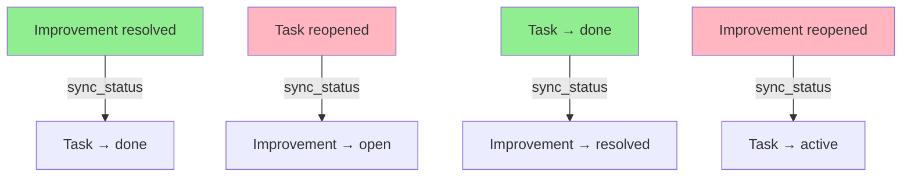
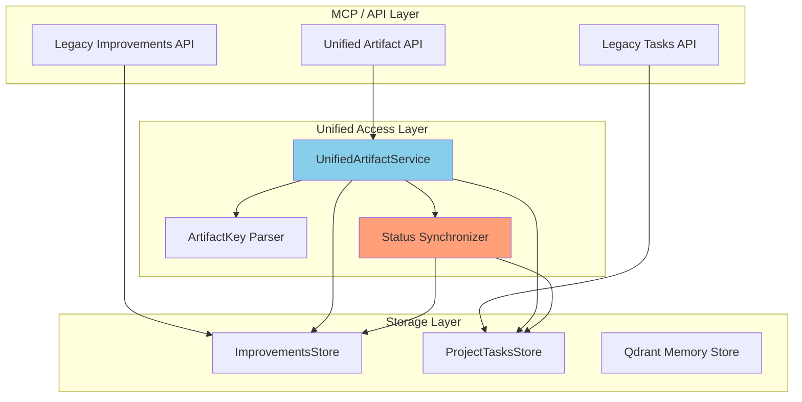
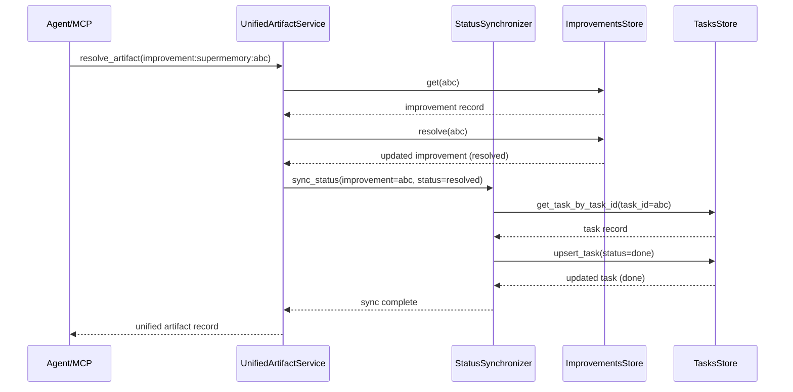

# Архитектура: Унифицированный доступ и синхронизация Improvements и Tasks

## Обзор

Документ описывает архитектуру для унификации доступа и синхронизации между двумя сущностями:
- **Improvements** (улучшения/баги) - хранятся в `qdrant_data/improvements.db`
- **Tasks** (задачи проекта) - хранятся в `qdrant_data/project_tasks.db`

## Текущие проблемы (детальный анализ)

### 1. Разные идентификаторы и хранилища
- **Improvements:** UUID в `improvements.db` (через `ImprovementsStore`)
- **Tasks:** UUID в `project_tasks.db` (через `ProjectTasksStore`)
- **Связь:** Только через `task.linked_improvement_id` (ограничение 64 символа)
- **Проблема:** Нет обратной связи от task к improvement, сложно найти improvement по task

### 2. Разные паттерны доступа
- **Improvements:** `list_improvements()` → возвращает список improvements
- **Tasks:** `list_tasks()` → возвращает список tasks
- **Проблема:** Нет единого API для получения сущности по ID независимо от типа
- **Проблема:** Агенты должны знать тип сущности перед запросом

### 3. Отсутствие двусторонней синхронизации статусов
- **Improvement resolved** → task не автоматически меняет статус
- **Task reopened** → improvement не автоматически меняет статус
- **Task → done** → improvement не автоматически меняет статус
- **Проблема:** Статусы живут независимо, создается рассинхронизация
- **Проблема:** Нет правил разрешения конфликтов при одновременном изменении

### 4. Разные MCP endpoints
- `list_improvements` - только для improvements
- `memory_get` - только для memories (не для improvements/tasks)
- **Проблема:** Агенты не знают, какой endpoint использовать
- **Проблема:** Нет единого интерфейса для работы с artifact'ами

### 5. Отсутствие унифицированной модели данных
- **ImprovementRecord:** имеет `importance_score`, `resolved_at`, `report_count`
- **ProjectTaskRecord:** имеет `task_id`, `source`, `topic_path`, `task_capture_*`
- **Проблема:** Нет общего интерфейса для работы с обеими сущностями
- **Проблема:** Сложно создавать универсальные компоненты UI/UX

## Архитектурное решение

### 1. Унифицированный идентификатор (artifact_key)

Вводим `artifact_key` - канонический идентификатор, который работает для обеих сущностей:

```python
# Формат: {type}:{project}:{local_id}
# Примеры:
# - improvement:supermemory:dcde5e07-744a-4836-b08c-e18300eccf78
# - task:supermemory:6174ad7b-1fd9-4b6b-bb59-4f932b8cfc8c

@dataclass
class ArtifactKey:
    type: Literal["improvement", "task"]
    project: str
    local_id: str  # UUID

    @classmethod
    def parse(cls, key: str) -> "ArtifactKey":
        type_, project, local_id = key.split(":")
        return cls(type=type_, project=project, local_id=local_id)

    def __str__(self) -> str:
        return f"{self.type}:{self.project}:{self.local_id}"
```

### 2. Каноническая связь (canonical_link)

Добавляем двустороннюю связь между improvements и tasks:

```python
# В improvements.db
ALTER TABLE improvements ADD COLUMN linked_task_id TEXT;

# В project_tasks.db
# linked_improvement_id уже существует, расширяем до 64+ символов
```

### 3. Унифицированный слой доступа

Создаем `app/services/unified_artifact_service.py`:

```python
class UnifiedArtifactService:
    """Единый фасад для доступа к improvements и tasks."""

    async def get_artifact(self, artifact_key: ArtifactKey) -> UnifiedArtifactRecord:
        """Получить сущность по artifact_key независимо от типа."""

    async def resolve_artifact(self, artifact_key: ArtifactKey, **kwargs) -> UnifiedArtifactRecord:
        """Разрешить сущность (improvement→resolved, task→done)."""

    async def reopen_artifact(self, artifact_key: ArtifactKey, **kwargs) -> UnifiedArtifactRecord:
        """Переоткрыть сущность (improvement→open, task→active)."""

    async def list_artifacts(
        self,
        project: str,
        status: str | None = None,
        type: str | None = None,
        limit: int = 50,
    ) -> list[UnifiedArtifactRecord]:
        """Получить список сущностей с фильтрацией по типу и статусу."""
```

### 4. Двусторонняя синхронизация статусов

**Scope синхронизации:**
- ✅ **Статусы:** open/resolved ↔ planning/active/done
- ❌ **Метаданные:** title, description - НЕ синхронизируются
- ❌ **Изменения (changes):** НЕ синхронизируются
- ❌ **Связи (links):** НЕ синхронизируются

**Почему только статусы?**
- Статусы - это единственное, что логически связано между improvements и tasks
- Метаданные могут отличаться (improvement = проблема, task = решение)
- Изменения специфичны для каждой сущности
- Связи управляются отдельно через linked_task_id/linked_improvement_id



**Правила синхронизации:**

| Действие | Improvement | Task | Приоритет | Синхронизируется |
|----------|-------------|------|-----------|------------------|
| Improvement resolved | resolved | done | Improvement | ✅ Да |
| Task reopened | open | active | Task | ✅ Да |
| Task → done | resolved | done | Task | ✅ Да |
| Improvement reopened | open | active | Improvement | ✅ Да |
| Improvement title changed | - | - | - | ❌ Нет |
| Task description changed | - | - | - | ❌ Нет |
| Task change added | - | - | - | ❌ Нет |

**Приоритет:** Последнее действие имеет приоритет. Если improvement и task меняются одновременно, побеждает тот, кто был изменен последним (по `updated_at` timestamp).

**Механизм синхронизации:**

```python
class StatusSynchronizer:
    async def sync_from_improvement(
        self,
        improvement_id: UUID,
        new_status: str,
        acted_by: str,
        reason: str,
    ) -> None:
        """Синхронизировать статус из improvement в task."""
        # 1. Получить improvement
        improvement = await improvements_store.get(improvement_id)
        if not improvement:
            return

        # 2. Получить связанный task
        task = await tasks_store.get_task_by_task_id(
            project=improvement.project,
            task_id=str(improvement.id),
        )
        if not task:
            return

        # 3. Определить целевой статус task
        target_status = self._map_improvement_to_task_status(new_status)

        # 4. Проверить приоритет (task не был изменен позже)
        if task.updated_at > improvement.updated_at:
            logger.warning(
                f"Task {task.id} was updated after improvement {improvement.id}, "
                f"skipping sync to avoid conflict"
            )
            return

        # 5. Применить изменение
        await tasks_store.upsert_task(
            memory_id=str(task.id),
            status=target_status,
            updated_at=datetime.now(timezone.utc).timestamp(),
        )

        # 6. Логирование
        logger.info(
            f"Synced status from improvement {improvement.id} to task {task.id}: "
            f"{new_status} → {target_status}"
        )

    def _map_improvement_to_task_status(self, improvement_status: str) -> str:
        """Отобразить статус improvement на статус task."""
        mapping = {
            "open": "active",
            "resolved": "done",
        }
        return mapping.get(improvement_status, "planning")
```

### 5. Нормализация list/report endpoints

```python
# Новый unified endpoint
@router.get("/artifacts")
async def list_artifacts(
    project: str,
    status: str | None = None,
    type: str | None = None,  # "improvement", "task", or None (both)
    limit: int = 50,
) -> UnifiedArtifactListResponse:
    """Единый endpoint для списка improvements и tasks."""
```

**Response включает:**
- `artifact_key` - унифицированный ключ
- `type` - "improvement" или "task"
- `status` - унифицированный статус
- `linked_artifact_key` - ссылка на связанную сущность
- `linked_status` - статус связанной сущности
- Все остальные поля из оригинальной сущности

### 6. Backfill для существующих записей

```python
async def backfill_unified_artifacts():
    """Заполнить artifact_key и canonical links для существующих записей."""

    # 1. Для improvements с linked task
    for improvement in improvements_store.list():
        task = tasks_store.get_task_by_task_id(
            project=improvement.project,
            task_id=improvement.id  # task_id = improvement.id
        )
        if task:
            # Установить двустороннюю связь
            improvement_store.set_linked_task_id(improvement.id, task.id)
            # task.linked_improvement_id уже должен быть установлен

    # 2. Для tasks с linked improvement
    for task in tasks_store.list_tasks():
        if task.linked_improvement_id:
            improvement = improvements_store.get(UUID(task.linked_improvement_id))
            if improvement:
                # Установить обратную связь
                improvement_store.set_linked_task_id(improvement.id, task.id)
```

## Диаграмма архитектуры



## Детальная диаграмма синхронизации



## Модель данных

### UnifiedArtifactRecord

```python
@dataclass
class UnifiedArtifactRecord:
    artifact_key: str  # "improvement:supermemory:abc" or "task:supermemory:def"
    type: str  # "improvement" or "task"
    id: UUID  # локальный ID
    project: str
    title: str
    description: str
    status: str  # унифицированный статус
    agent_id: str
    tags: list[str]
    created_at: datetime
    updated_at: datetime

    # Поля для improvements
    importance_score: float | None = None
    resolved_at: datetime | None = None
    report_count: int | None = None

    # Поля для tasks
    task_id: str | None = None
    source: str | None = None
    topic_path: str | None = None
    task_capture_pending_count: int | None = None
    task_capture_promoted_count: int | None = None
    task_statement_incomplete: bool | None = None

    # Связанные сущности
    linked_artifact_key: str | None = None  # "task:supermemory:def" или "improvement:supermemory:abc"
    linked_status: str | None = None  # статус связанной сущности
```

### Унифицированные статусы

| Improvement | Task | Unified |
|-------------|------|---------|
| open | planning | open |
| open | active | active |
| resolved | done | done |
| - | paused | paused |
| - | archived | archived |

## MVP (Минимально жизнеспособный продукт)

### MVP Phase 1: Унифицированный доступ (без синхронизации)
**Цель:** Единый API для доступа к improvements и tasks

**Включает:**
- `ArtifactKey` parser
- `UnifiedArtifactService` с базовыми методами:
  - `get_artifact(artifact_key)`
  - `list_artifacts(project, status, type, limit)`
- Unified API endpoint `/artifacts`
- MCP tools `get_artifact` и `list_artifacts`

**Исключает:**
- Синхронизацию статусов
- Backfill для существующих данных
- Rollout стратегию

**Критерии успеха MVP Phase 1:**
- ✅ `get_artifact()` работает для improvements
- ✅ `get_artifact()` работает для tasks
- ✅ `list_artifacts()` возвращает смешанный список
- ✅ MCP tools работают с унифицированным API

### MVP Phase 2: Синхронизация статусов
**Цель:** Автоматическая синхронизация статусов между improvements и tasks

**Включает:**
- `StatusSynchronizer` класс
- Триггеры синхронизации в endpoints
- Backfill для существующих данных

**Критерии успеха MVP Phase 2:**
- ✅ Синхронизация improvement→task работает
- ✅ Синхронизация task→improvement работает
- ✅ Backfill заполняет связи для существующих данных

## Edge Cases

### 1. Множественные связи
**Сценарий:** Improvement связан с несколькими tasks

**Текущее поведение:** Не поддерживается (1:1 связь)

**Решение:**
- Валидация при создании связи: если improvement уже имеет linked_task_id, отклонить новую связь
- Логирование предупреждения при попытке создать множественную связь
- Будущее расширение: поддержка N:M связей через отдельную таблицу

### 2. Отсутствие связи
**Сценарий:** Task без `linked_improvement_id`

**Текущее поведение:** Task работает автономно

**Решение:**
- Task может существовать без improvement
- Improvement может существовать без task
- Синхронизация только при наличии связи

### 3. Конфликт статусов при одновременном изменении
**Сценарий:** Improvement и task меняются одновременно

**Текущее поведение:** Не определено

**Решение:**
- Приоритет последнего изменения (по timestamp)
- Оптимистичная блокировка с version field
- Логирование конфликтов для анализа

### 4. Удаление сущности при наличии связи
**Сценарий:** Удаление improvement при наличии связанного task

**Текущее поведение:** Не определено

**Решение:**
- Soft delete: пометить как deleted, сохранить связь
- Cascade delete: удалить связанный task (опционально)
- Валидация: запретить удаление при наличии связи (по умолчанию)

### 5. Некорректный artifact_key
**Сценарий:** Неверный формат artifact_key

**Текущее поведение:** Не определено

**Решение:**
- Валидация формата при парсинге
- Возврат 400 Bad Request с детальным сообщением
- Логирование некорректных запросов

### 6. Разные проекты
**Сценарий:** Improvement и task в разных проектах

**Текущее поведение:** Не определено

**Решение:**
- Валидация: связывать только сущности из одного проекта
- Логирование предупреждения при попытке создать межпроектную связь

## Требования к производительности (SLA)

### Latency Requirements (p95)

| Операция | Требование | Текущее (базовый) | Цель |
|----------|------------|-------------------|------|
| `get_artifact()` | < 50ms | ~20ms (single store) | ~30ms (unified) |
| `list_artifacts(limit=50)` | < 100ms | ~40ms (single store) | ~80ms (unified) |
| `resolve_artifact()` | < 200ms | ~50ms (no sync) | ~150ms (with sync) |
| `reopen_artifact()` | < 200ms | ~50ms (no sync) | ~150ms (with sync) |
| `backfill(1000 records)` | < 10s | N/A | ~5s |

### Throughput Requirements

| Операция | Требование | Примечание |
|----------|------------|------------|
| `get_artifact()` | > 100 req/s | Single instance |
| `list_artifacts()` | > 50 req/s | Single instance |
| `sync_status()` | > 20 req/s | Single instance |

### Resource Requirements

| Ресурс | Требование | Примечание |
|--------|------------|------------|
| Memory overhead | < 50MB | Для кэша artifact keys |
| DB connections | +2 connections | Для unified service |
| Storage overhead | < 1MB | Для linked_task_id |

## Rollback стратегия

### 1. Database Migrations

**Принцип:** Все миграции должны быть обратимыми

```sql
-- Forward migration
ALTER TABLE improvements ADD COLUMN linked_task_id TEXT;

-- Rollback migration
ALTER TABLE improvements DROP COLUMN linked_task_id;
```

**Процесс:**
1. Создать backup перед миграцией
2. Запустить миграцию в dry-run режиме
3. Применить миграцию
4. Верифицировать результаты
5. При ошибке: восстановить из backup

### 2. Code Rollback

**Принцип:** Feature flags для новых endpoints

```python
# config.py
UNIFIED_ARTIFACT_API_ENABLED = os.getenv("UNIFIED_ARTIFACT_API_ENABLED", "false")

# router.py
if settings.UNIFIED_ARTIFACT_API_ENABLED:
    @router.get("/artifacts")
    async def list_artifacts(...):
        ...
```

**Процесс:**
1. Включить feature flag для 10% traffic
2. Мониторинг метрик и ошибок
3. При проблемах: отключить feature flag
4. Legacy endpoints продолжают работать

### 3. Data Recovery

**Принцип:** Backfill с dry-run режимом

```python
async def backfill_unified_artifacts(dry_run: bool = True):
    """Заполнить artifact_key и canonical links."""
    if dry_run:
        # Только логирование, без изменений
        logger.info(f"Would link improvement {imp.id} to task {task.id}")
    else:
        # Применить изменения
        improvement_store.set_linked_task_id(imp.id, task.id)
```

**Процесс:**
1. Запустить backfill в dry-run режиме
2. Проверить логи на наличие ошибок
3. Применить backfill
4. Верифицировать результаты
5. При ошибке: восстановить из backup

## Roll-out стратегия

### Phase 1: Canary (10% traffic)

**Цель:** Проверить стабильность на небольшом объеме

**Действия:**
1. Включить `UNIFIED_ARTIFACT_API_ENABLED` для 10% пользователей
2. Мониторинг метрик:
   - Latency (p95, p99)
   - Error rate
   - DB connection pool
3. Мониторинг логов:
   - Ошибки синхронизации
   - Предупреждения о edge cases
4. Длительность: 24 часа

**Критерии успеха:**
- Error rate < 0.1%
- Latency p95 < 100ms
- Нет критических ошибок в логах

**Критические проблемы:**
- Error rate > 1%
- Latency p95 > 200ms
- Критические ошибки в логах

**Действия при проблемах:**
- Отключить feature flag
- Проанализировать логи
- Исправить проблемы
- Повторить Phase 1

### Phase 2: Gradual (50% traffic)

**Цель:** Проверить масштабируемость

**Действия:**
1. Увеличить до 50% пользователей
2. Мониторинг метрик (как в Phase 1)
3. Дополнительный мониторинг:
   - DB query performance
   - Cache hit rate
   - Memory usage
4. Длительность: 48 часов

**Критерии успеха:**
- Error rate < 0.05%
- Latency p95 < 80ms
- DB query time < 10ms (p95)

### Phase 3: Full (100% traffic)

**Цель:** Полный roll-out

**Действия:**
1. Увеличить до 100% пользователей
2. Мониторинг метрик (как в Phase 2)
3. Длительность: 7 дней

**Критерии успеха:**
- Error rate < 0.01%
- Latency p95 < 50ms
- Стабильная работа в течение 7 дней

### Phase 4: Deprecation (legacy endpoints)

**Цель:** Удаление legacy endpoints

**Действия:**
1. Добавить deprecation warnings в legacy endpoints
2. Обновить документацию
3. Уведомить пользователей о миграции
4. Длительность: 2 недели

**Критерии успеха:**
- < 5% traffic на legacy endpoints
- Нет жалоб от пользователей

**Действия при проблемах:**
- Продлить период deprecation
- Усилить уведомления

## План реализации

### Фаза 1: Инфраструктура
1. Создать `app/services/unified_artifact_service.py`
2. Создать `app/models/unified_artifact.py`
3. Добавить миграцию для `linked_task_id` в improvements.db
4. Реализовать `ArtifactKey` parser

### Фаза 2: Унифицированный доступ
1. Реализовать `get_artifact()` в `UnifiedArtifactService`
2. Реализовать `list_artifacts()` в `UnifiedArtifactService`
3. Создать unified API endpoint `/artifacts`
4. Добавить MCP tool `get_artifact` и `list_artifacts`

### Фаза 3: Синхронизация статусов
1. Реализовать `StatusSynchronizer` класс
2. Добавить триггеры синхронизации в:
   - `resolve_improvement()` endpoint
   - `reopen_task()` endpoint
   - `update_task_status()` (если есть)
3. Добавить тесты для синхронизации

### Фаза 4: Backfill
1. Реализовать `backfill_unified_artifacts()`
2. Создать admin endpoint для запуска backfill
3. Запустить backfill для существующих данных
4. Верифицировать результаты

### Фаза 5: Тестирование
1. Тесты для `get_artifact()` (improvement, task, not found)
2. Тесты для `list_artifacts()` (фильтры по типу, статусу)
3. Тесты для синхронизации (improvement→task, task→improvement)
4. Тесты для backfill
5. Интеграционные тесты с MCP tools

### Фаза 6: Документация и миграция
1. Обновить документацию для агентов
2. Обновить MCP tool descriptions
3. Создать migration guide для пользователей
4. Deprecation warnings для legacy endpoints

## Ограничения

1. **Безопасность:** Не нарушать существующие хранилища
2. **Совместимость:** Legacy endpoints продолжают работать
3. **Производительность:** Минимизировать дополнительные запросы к БД
4. **Консистентность:** Гарантировать атомарность синхронизации

## Критерии готовности (Definition of Done)

### MVP Phase 1: Унифицированный доступ

1. ✅ `get_artifact(artifact_key)` возвращает корректную запись для improvements
2. ✅ `get_artifact(artifact_key)` возвращает корректную запись для tasks
3. ✅ `get_artifact(artifact_key)` возвращает 404 для несуществующей сущности
4. ✅ `list_artifacts()` возвращает смешанный список improvements и tasks
5. ✅ `list_artifacts(type="improvement")` возвращает только improvements
6. ✅ `list_artifacts(type="task")` возвращает только tasks
7. ✅ `list_artifacts(status="open")` фильтрует по статусу
8. ✅ Unified API endpoint `/artifacts` работает
9. ✅ MCP tool `get_artifact` работает
10. ✅ MCP tool `list_artifacts` работает
11. ✅ Все существующие тесты продолжают проходить
12. ✅ Новые тесты покрывают унифицированный доступ

### MVP Phase 2: Синхронизация статусов

13. ✅ Синхронизация improvement→task работает при resolve
14. ✅ Синхронизация task→improvement работает при reopen
15. ✅ Синхронизация task→improvement работает при task→done
16. ✅ Синхронизация improvement→task работает при improvement→open
17. ✅ Конфликт статусов разрешается корректно (приоритет последнего)
18. ✅ Backfill успешно заполняет связи для существующих записей
19. ✅ Edge cases обрабатываются корректно
20. ✅ Новые тесты покрывают синхронизацию

### Production Ready

21. ✅ Latency p95 < 50ms для `get_artifact()`
22. ✅ Latency p95 < 100ms для `list_artifacts()`
23. ✅ Latency p95 < 200ms для `resolve_artifact()`
24. ✅ Error rate < 0.01%
25. ✅ Документация обновлена для агентов
26. ✅ API documentation создана
27. ✅ Migration guide создан
28. ✅ Rollback стратегия протестирована
29. ✅ Roll-out стратегия выполнена успешно
30. ✅ Legacy endpoints имеют deprecation warnings

## Требования к документации

### 1. Документация для агентов

**Целевая аудитория:** AI агенты, использующие MCP tools

**Содержание:**
- Обзор унифицированного API
- Описание `artifact_key` формата
- Примеры использования MCP tools:
  - `get_artifact(artifact_key)`
  - `list_artifacts(project, status, type, limit)`
- Правила синхронизации статусов
- Edge cases и их обработка
- Migration guide от legacy endpoints

**Формат:** Markdown в `docs/agent-guide/unified-artifacts.md`

### 2. API Documentation

**Целевая аудитория:** Разработчики, интегрирующие API

**Содержание:**
- OpenAPI/Swagger спецификация
- Описание всех endpoints:
  - `GET /artifacts` - список artifacts
  - `GET /artifacts/{artifact_key}` - получить artifact
  - `POST /artifacts/{artifact_key}/resolve` - разрешить artifact
  - `POST /artifacts/{artifact_key}/reopen` - переоткрыть artifact
- Схемы запросов и ответов
- Примеры запросов (curl, Python, JavaScript)
- Коды ошибок и их обработка

**Формат:** OpenAPI 3.0 в `docs/api/unified-artifacts.yaml`

### 3. Архитектурная документация

**Целевая аудитория:** Разработчики, архитекторы

**Содержание:**
- Обзор архитектуры
- Компоненты и их взаимодействие
- Диаграммы:
  - Архитектура системы
  - Поток синхронизации статусов
  - Sequence diagrams
- Модель данных
- Правила синхронизации
- Edge cases
- Performance considerations

**Формат:** Markdown в `docs/architecture/unified-artifacts.md`

### 4. Migration Guide

**Целевая аудитория:** Пользователи, мигрирующие с legacy endpoints

**Содержание:**
- Обзор изменений
- Сравнение legacy и unified endpoints:
  - `list_improvements` → `list_artifacts(type="improvement")`
  - `list_tasks` → `list_artifacts(type="task")`
  - `memory_get` → `get_artifact`
- Пошаговая миграция
- Примеры кода до и после
- FAQ
- Known issues и workarounds

**Формат:** Markdown в `docs/migration/unified-artifacts.md`

### 5. Operations Documentation

**Целевая аудитория:** DevOps, SRE

**Содержание:**
- Rollout стратегия
- Rollback процедуры
- Мониторинг:
  - Метрики (latency, error rate, throughput)
  - Логи
  - Alerts
- Troubleshooting:
  - Общие проблемы
  - Диагностика
  - Решения
- Backfill процедуры
- Database migrations

**Формат:** Markdown в `docs/operations/unified-artifacts.md`

## Риски и митигация

| Риск | Митигация |
|------|-----------|
| Race conditions при синхронизации | Использовать транзакции и оптимистичную блокировку |
| Производительность при list_artifacts() | Кэширование и пагинация |
| Потеря данных при backfill | Dry-run режим и валидация перед применением |
| Сложность отладки | Детальное логирование синхронизации |
| Обратная совместимость | Legacy endpoints остаются без изменений |

## Следующие шаги

1. Создать `app/services/unified_artifact_service.py` с базовой структурой
2. Создать `app/models/unified_artifact.py` с моделями данных
3. Написать первые тесты для `ArtifactKey` parser
4. Реализовать миграцию для `linked_task_id`
5. Начать с реализации `get_artifact()` без синхронизации
